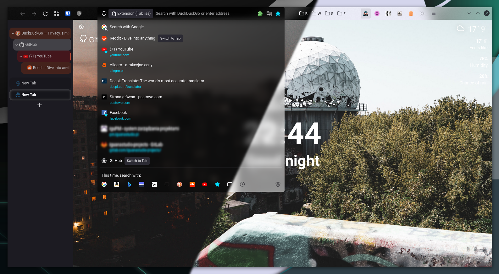

# blurclean-firefox-theme
 

 <i>Example look of the browser</i>

## About
+ supports both dark and light theme
+ tested on Manjaro KDE and Windows 10
+ by default only brings back icons in menus and makes urlbar transparent
+ theme is created using many files imported in userCrome, if you do not want some features you can simply comment out lines with `@import`
+ transparency on popups is limited to urlbar, because you can't get blur on them and it looks bad without it
+ window transparencies make problems on non GNU/Linux systems, but this is not problem by default

## Installation

1. Open `about:config` and set this preferences to **'true'** 

+ **`toolkit.legacyUserProfileCustomizations.stylesheets`**
+ **`svg.context-properties.content.enabled`**
+ **`layers.acceleration.force-enabled`**
+ **`gfx.webrender.all`**
+ **`gfx.webrender.enabled`**
+ **`layout.css.backdrop-filter.enabled`**

2. Go to `about:profiles` and find your `Root Directory` and enter there.
3. Next step you can solve with two ways:
+ create new directory `chrome` and copy there repo content
+ open terminal, when you are in `Root Directory` use `git clone https://github.com/Filip-Sutkowy/blurclean-firefox-theme chrome`

## Optional steps

+ Install TreeStyleTab addon and paste content of `tst_theme.css` in Tree Style Tab / Preferences / Advanced / Extra style.
+ Uncomment optional TST styles in userChrome
+ Uncomment optional transparencies for window (only for GNU/Linux)
+ move `Bookmarks toolbar items` next to url bar to save some vertical space

## Blur
First, make sure that you have enabled optional styles in userChrome. Then you have to enable blur in compositor, where to find this option is based on your desktop environment, here is how to enable it with KDE:
+ Enable blur in System Settings / Workspace / Workspace Behavior / Deskop Effects
+ Download and enable **Force Blur** script in System Settings / Workspace / Window Management / KWin Scripts. Relogin to enable script configuration. Now add firefox in script config.
+ **Force Blur** need this two command to start working (maybe it's already fixed, check comments [here](https://store.kde.org/p/1294604/))
	+ `mkdir -p ~/.local/share/kservices5/`
	+ `cp ~/.local/share/kwin/scripts/forceblur/metadata.desktop ~/.local/share/kservices5/forceblur.desktop`
+ Now should working

## Reccomended Addons
These addons make this theme better
+ [TST Colored Tabs](https://addons.mozilla.org/en-US/firefox/addon/tst-colored-tabs) - You can use it instead of colouring in `tst_theme.css`, I don't use this addon because you can't get tranparency on tabs.
+ [Dark Reader](https://addons.mozilla.org/en-US/firefox/addon/darkreader) | [Dark Background and Light Text](https://addons.mozilla.org/en-US/firefox/addon/dark-background-light-text/) | [Darker Background Brighter Font](https://addons.mozilla.org/en-US/firefox/addon/darker-bg-brighter-font) or other addons which makes every page **DARK**
+ [Tabliss](https://addons.mozilla.org/en-US/firefox/addon/tabliss/) | [Momentum](https://addons.mozilla.org/en-US/firefox/addon/momentumdash) | [Speed Dial](https://addons.mozilla.org/en-US/firefox/addon/fvd-speed-dial) or other new page extension

## Uninstalling 
Just remove `chrome` folder, you can also reset changed config options, but this is not nessesary.
